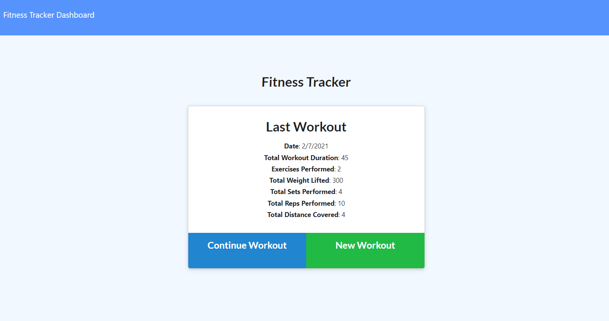
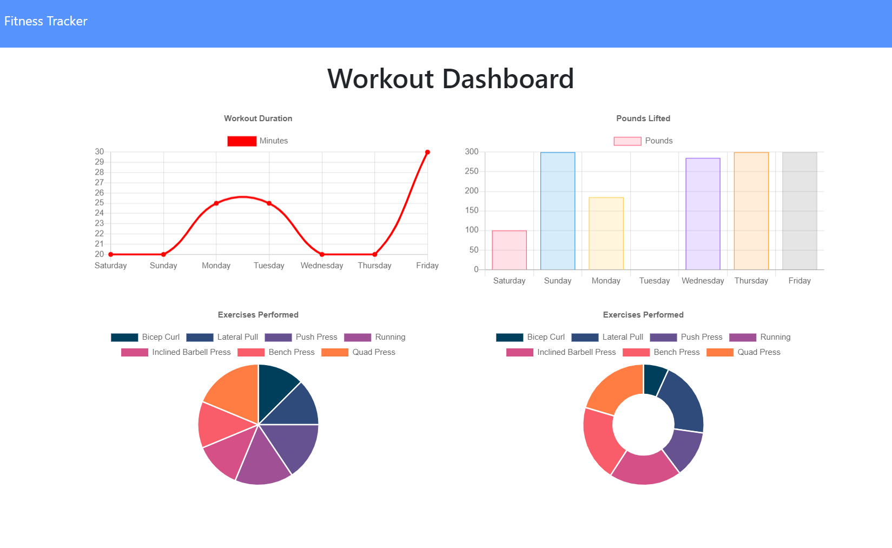

# fitness-advisor

## Table of Contents

- [fitness-advisor](#fitness-tracker)
- [Description](#description)
- [Installation](#installation)
- [Usage](#usage)
- [Licence](#licence)
- [Contributing](#Contributing)
- [Questions](#questions)

## Description

- Fitness Advisor is a cloud-based application allowing one to track: both resistance and cardio-based workouts, the duration of each exercise, the number of sets and repetitions performed, as well as weight lifted and / or distance covered for each activity.

- Total weight lifted and / or total distance covered for selected day is calculated and displayed.

- The dashboard feature uses Chart.js to display a workout activity summary for the week prior.





[GitHub Repo](https://www.github.com/brhestir/fitness-advisor)

[Deployed Heroku Site](https://limitless-dusk-72131.herokuapp.com/)

## Installation

```bash
npm install
```

## Usage

```bash
npm start
```

## Licence

MIT

## Contributing

Fork this repo and send me a pull request!

## Questions

Questions are welcome, contact me on GitHub or in the comments.
